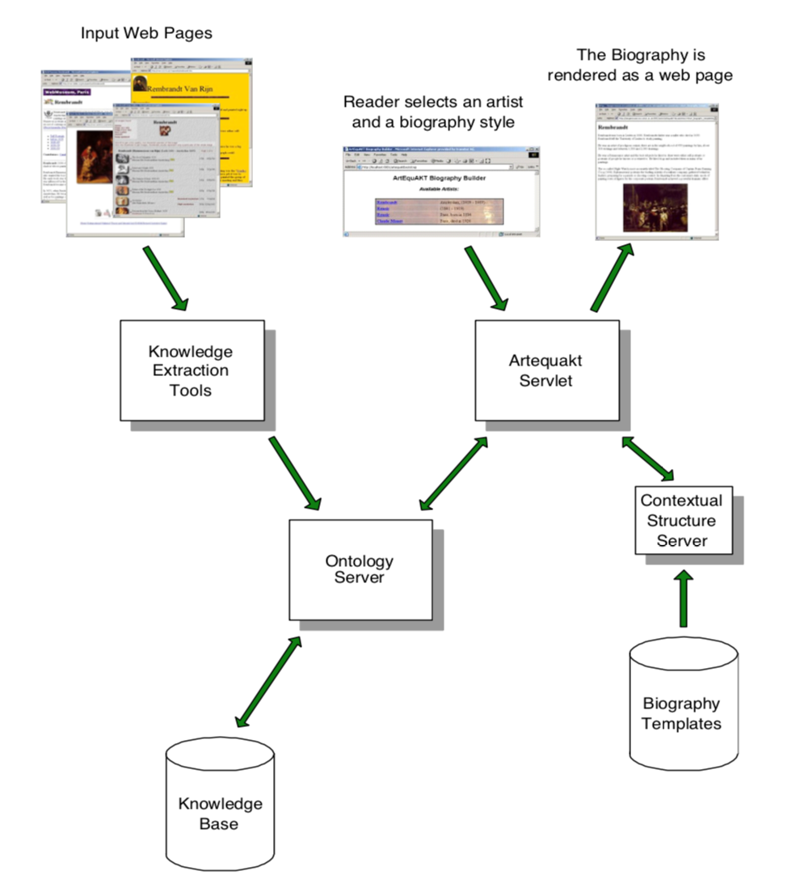
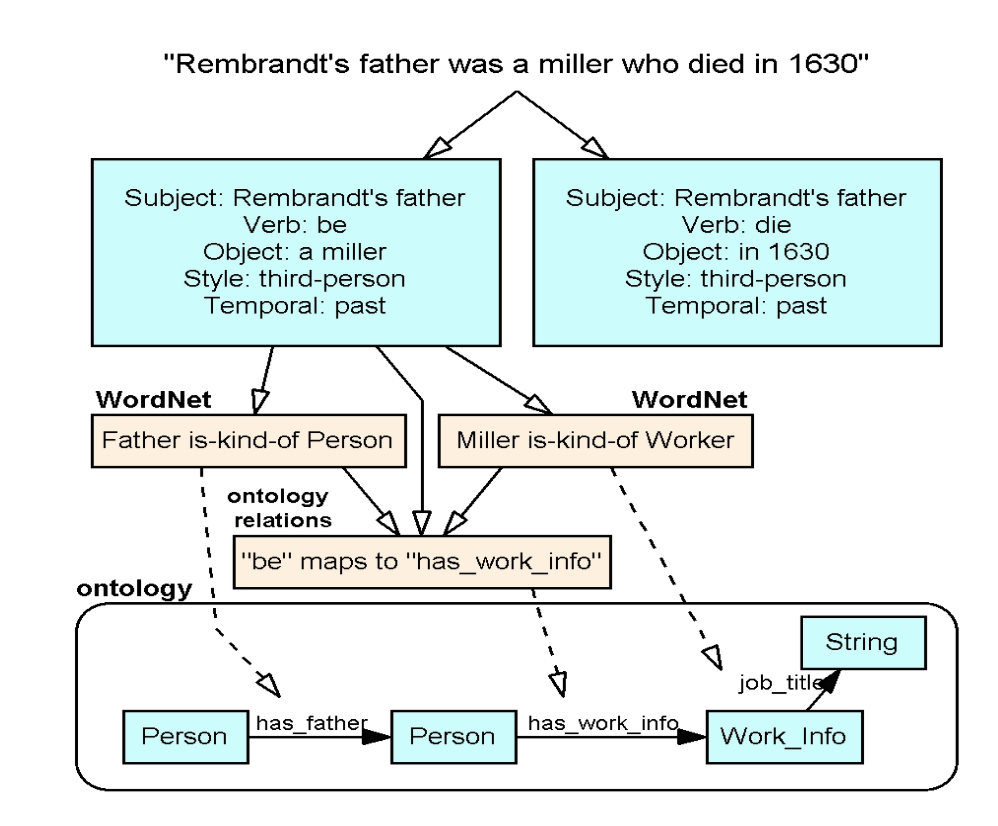
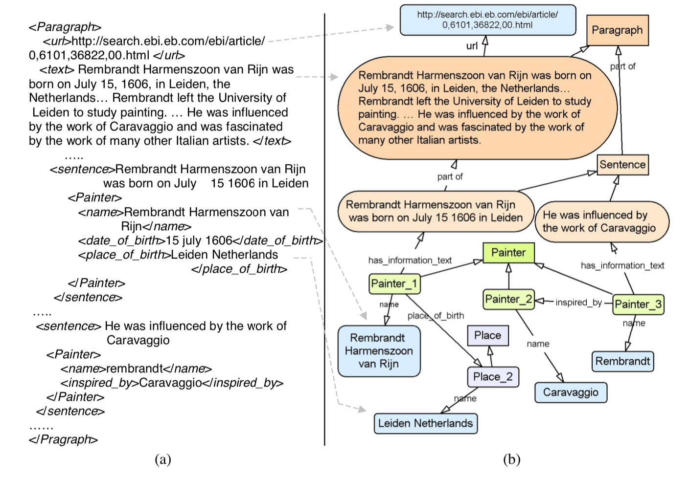
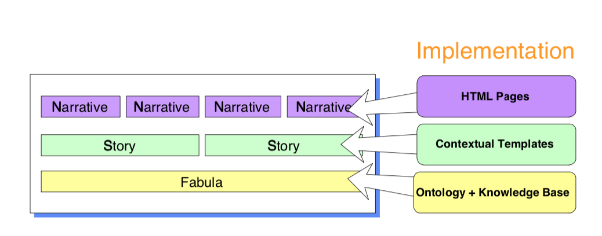
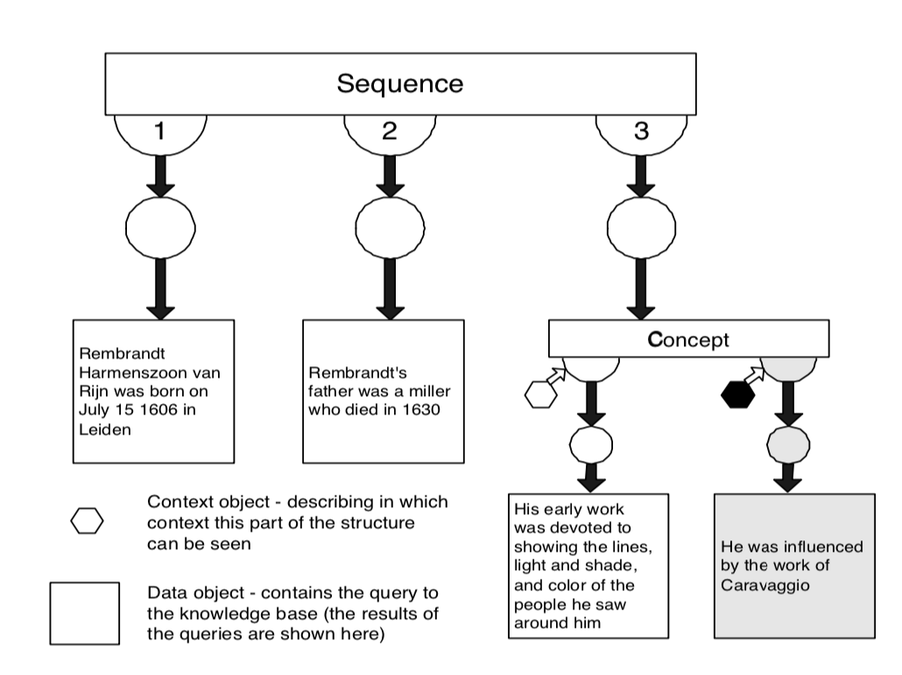

# Artequakt

## Overview

### Goal
* Our aim is to be able to **generate automatically tailored biographies** from **a knowledge base which has been automatically populated** by annotating text fragments extracted from Web documents.

### System architecture
* Knowledge extraction
* Information management
* Biography construction
<p float="left">
	
</p>

### Knowledge extraction
<p float="left">
	
</p>

### Information management
<p float="left">
	
</p>

### Biography construction
<p float="left">
	
	
</p>

### Challenge
* Knowledge extraction for all the useful information
	* Different expression
	* Different words
	* Relation extraction
```

Rembrandt was born in the 17th century in Leiden. 

Rembrandt was born in 1606 in the Netherlands. 

Rembrandt was born on July 15 1606 in Holland.
```

* Consolidation process to filter duplicate instances
* Sophisticated narrative structuring of the knowledge fragment

## Good Parts

## Bad Parts

## Topic & Comparison
* No inference
* Limited usage of sematic web
* Template-based storytelling